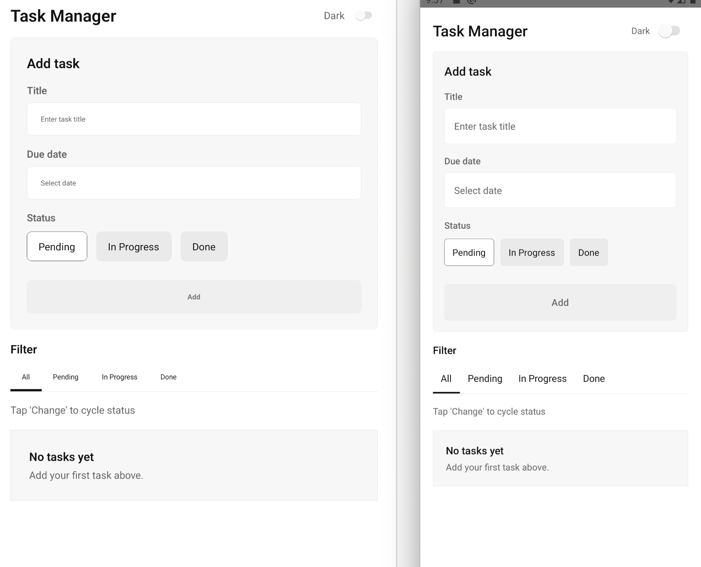

# Task Manager — Project Notes

## Tech

- React Native CLI (React Native 0.83)
- TypeScript
- State: local in-memory (`useState`), no Redux
- Target dev environment: Windows-friendly (Android via React Native CLI); iOS build requires macOS + CocoaPods.

## Requirements coverage

- Add tasks: title + due date + status
- View tasks list
- Update status per task (one-tap cycle: Pending → In Progress → Done)
- Filter tasks by status (includes “All”)

Data is stored in memory only (no API/database), per assignment.

Not included (per assignment): auth, persistence after restart, complex UI/animations.

## Architecture (high level)

- `src/screens` — screen composition (`TaskManagerScreen`) + small screen-only UI parts
- `src/components` — reusable UI (form, filter tabs, task row)
- `src/types` — domain model (`Task`, statuses, `NewTaskInput`)
- `src/theme` — light/dark tokens + theme controller
- `src/utils` — pure helpers (date formatting/parsing, status cycling, ids, scaling)

Reasoning: keep business state local (small app), but split UI/domain/util to keep files readable and scalable.

Code comments: kept short and only where intent isn’t obvious.

## Notable decisions

- Due date stored as local `YYYY-MM-DD` string to avoid timezone surprises.
- Sorting: earliest due date first, then newest created.
- Theme: follows system scheme until user toggles manually.

## Extra (out of scope / not required by the spec)

- Added a small scaling helper (`src/utils/scale.ts`) so UI sizes/paddings stay consistent across different screen sizes and pixel densities.
- Not required by the assignment, but consistent “visual density” matters on mobile, and this helper is intentionally tiny and doesn’t affect business logic.
  

## Validation / UX

- Basic form validation: required title, required date, date cannot be in the past.
- The form collapses after the first task for faster “add another task” flow.

## Tests

- Jest unit tests for utils (`__tests__/*`).

## How to run

Prereqs: Node.js 20+.

- Install: `npm install`
- Start Metro: `npm start`
- Android (Windows/macOS/Linux): `npm run android`

Note: iOS requires macOS + CocoaPods.

## Reflections (interesting / challenging parts)

- The most interesting part was setting up clear boundaries between reusable UI components and domain logic (types/utils), while keeping state local and the screen composition simple.

## If I had more time

- Backend API integration (sync tasks, retries/error states, optimistic updates)
- Authentication (session/token storage, refresh flow)
- More polished UI (visual hierarchy, animations, better empty/loading states)
- Delete tasks (and optionally edit)
